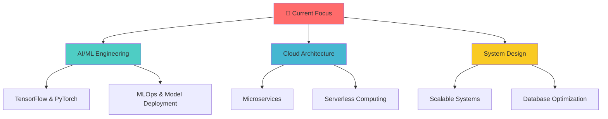

# 🌟 Welcome to My Digital Universe

<div align="center">
  
  
  
</div>

---

<p align="center">
  
</p>

<div align="center">
  
  ### 🚀 Turning Coffee into Code Since Forever ☕
  
  ```javascript
  const developer = {
    name: "Your Name",
    role: "Full Stack Magician",
    languages: ["JavaScript", "Python", "Go", "Rust"],
    passion: "Building things that matter",
    currentlyLearning: "AI & Machine Learning",
    funFact: "I debug with console.log and I'm not ashamed! 😄"
  };
  ```
  
</div>

---

## 🎭 About Me in Binary (Just Kidding!)


🌱 **Currently Growing:** Deep diving into AI/ML and cloud architecture  
💡 **Always Curious:** About emerging technologies and best practices  
🎯 **Mission:** Creating impactful solutions that solve real problems  
🔮 **Vision:** Building a more connected and automated world  
🎪 **Fun Mode:** When not coding, you'll find me exploring new places or gaming

<br/>

---

## 🛠️ My Arsenal of Tools

<div align="center">

### 💻 Languages & Frameworks


### ☁️ Cloud & DevOps


### 🗄️ Databases & Tools


</div>

---

## 📊 GitHub Analytics & Activity

<div align="center">
  
  
</div>

<div align="center">
  
</div>

<div align="center">
  
</div>

---

## 🏆 Achievements & Trophies

<div align="center">
  
</div>

---

## 🌟 Featured Projects

<div align="center">

[](https://github.com/YourUsername/project1)
[](https://github.com/YourUsername/project2)

</div>

---

## 🎯 Current Goals & Learning Path

<div align="center">



</div>

---

## 📈 Contribution Graph

<div align="center">
  
</div>

---

## 🌐 Let's Connect & Collaborate

<div align="center">

[](https://linkedin.com/in/yourprofile)
[](https://twitter.com/yourhandle)
[](https://yourwebsite.com)
[](mailto:your.email@gmail.com)

</div>

---

## 💭 Random Dev Thoughts

<div align="center">

*"Code is like humor. When you have to explain it, it's bad."* – Cory House


</div>

---

## 🎵 Currently Vibing To

<div align="center">
  
[](https://open.spotify.com/user/yourusername)

</div>

---

<div align="center">
  
  ### 🚀 Thanks for stopping by! Let's build something amazing together!
  
  
  
  
  
</div>

---

<div align="center">
  
</div>
