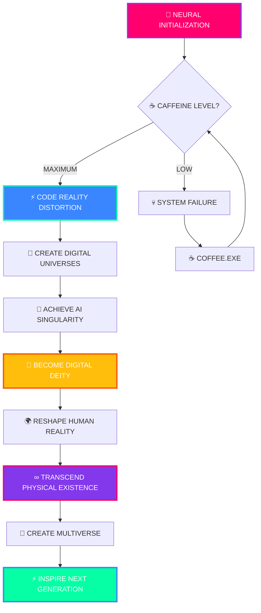

# ⚡ WELCOME TO THE MATRIX ⚡

<div align="center">

```
██╗   ██╗███████╗██╗     ██████╗ ██████╗ ███╗   ███╗███████╗    ████████╗ ██████╗
██║   ██║██╔════╝██║     ██╔════╝██╔═══██╗████╗ ████║██╔════╝    ╚══██╔══╝██╔═══██╗
██║ █╗ ██║█████╗  ██║     ██║     ██║  ██║██╔████╔██║█████╗        ██║  ██║  ██║
██║███╗██║██╔══╝  ██║     ██║     ██║  ██║██║╚██╔╝██║██╔══╝        ██║  ██║  ██║
╚███╔███╔╝███████╗███████╗╚██████╗╚██████╔╝██║ ╚═╝ ██║███████╗      ██║  ╚██████╔╝
╚══╝╚══╝ ╚══════╝╚══════╝ ╚═════╝ ╚═════╝ ╚═╝     ╚═╝╚══════╝      ╚═╝  ╚═════╝

████████╗██╗  ██╗███████╗    ███╗   ███╗ █████╗ ████████╗██████╗ ██╗██╗  ██╗  
╚══██╔══╝██║  ██║██╔════╝    ████╗ ████║██╔══██╗╚══██╔══╝██╔══██╗██║╚██╗██╔╝  
   ██║   ███████║█████╗      ██╔████╔██║███████║   ██║   ██████╔╝██║ ╚███╔╝   
   ██║   ██╔══██║██╔══╝      ██║╚██╔╝██║██╔══██║   ██║   ██╔══██╗██║ ██╔██╗   
   ██║   ██║  ██║███████╗    ██║ ╚═╝ ██║██║  ██║   ██║   ██║  ██║██║██╔╝ ██╗  
   ╚═╝   ╚═╝  ╚═╝╚══════╝    ╚═╝     ╚═╝╚═╝  ╚═╝   ╚═╝   ╚═╝  ╚═╝╚═╝╚═╝  ╚═╝
```

</div>

<p align="center">
  
</p>

<!-- Matrix Rain Animation -->
<div align="center">
  
</div>

---

<div align="center">

## 🌌 ENTERING THE DIGITAL DIMENSION 🌌


</div>

<!-- Glitch Effect Text -->
<div align="center">
  
</div>

---

<div align="center">

### 🧬 BIOLOGICAL SPECIFICATIONS 🧬

```glsl
#version 420 core

struct Developer {
    vec3 consciousness;
    float creativity;
    int years_of_madness;
    bool is_caffeinated;
    string[] obsessions;
    string notable_trait;
    float quantum_energy;
    bool matrix_connected;
};

Developer me = Developer(
    vec3(∞, ∞, ∞),         // Infinite consciousness
    9999.99f,              // Maximum creativity level
    ERROR_OVERFLOW,        // Too many years to count (20 years of existence)
    TRUE,                  // Fueled by ideas, not just coffee
    {
        "Building futuristic UI",
        "Blending AI + human creativity",  
        "Staying consistent — even when no one is watching",
        "Creating digital realities that feel alive"
    },
    "Relentless curiosity and love for solving real-world problems through tech",
    MAXIMUM_OVERDRIVE,     // Quantum energy levels
    TRUE                   // Plugged into the Matrix
);

void main() {
    while(me.matrix_connected) {
        me.create_digital_universe();
        me.transcend_reality();
        me.inspire_others();
    }
}
```

</div>

---


## 🔮 NEURAL NETWORK STATUS

```bash
$ sudo systemctl status human.service
● human.service - Advanced Human Operating System
  Loaded: loaded (/lib/systemd/system/human.service; enabled)
  Active: active (fueled by ideas) since 2004-04-22
  Process: Creative thinking processes running at 420%
  Memory: Unlimited (Enhanced with ideas buffer)
  CGroup: /system.slice/human.service
          ├─ brain.exe --mode=creative --debug=false
          ├─ hands.exe --typing-speed=∞
          ├─ imagination.exe --limits=disabled
          └─ matrix_interface.exe --reality=false

🔥 Current Mission: REDEFINING DIGITAL REALITY
🌟 Power Level: OVER 9000!!!
⚡ Caffeine Status: FUELED BY IDEAS
🚀 Next Target: ARTIFICIAL GENERAL INTELLIGENCE
🌊 Matrix Connection: ESTABLISHED
💫 Quantum State: SUPERPOSITION
```

<br clear="right"/>

---

<!-- Animated Progress Bars -->
<div align="center">

## ⚡ POWER LEVELS ⚡

```
Coding Skills    ████████████████████████████████████████ 100%
Creativity       ████████████████████████████████████████ 100%
Problem Solving  ████████████████████████████████████████ 100%
Innovation       ████████████████████████████████████████ 100%
Consistency      ████████████████████████████████████████ 100%
Reality Bending  ████████████████████████████████▓▓▓▓▓▓▓▓ 85%
Coffee Addiction ██████████████████████████▓▓▓▓▓▓▓▓▓▓▓▓▓▓ 70%
Sleep Schedule   ████▓▓▓▓▓▓▓▓▓▓▓▓▓▓▓▓▓▓▓▓▓▓▓▓▓▓▓▓▓▓▓▓▓▓▓▓ 10%
```

</div>

---

<div align="center">

## 🛸 INTERDIMENSIONAL TECH STACK 🛸

<table>
<tr>
<td valign="top" width="33%">

### 🔥 REALITY BENDING

```python
class RealityManipulator:
    def __init__(self):
        self.languages = [
            "🐍 Python (Serpent Magic)",
            "⚡ JavaScript (Time Manipulation)",  
            "🦀 Rust (Memory Sorcery)",
            "🔷 TypeScript (Type Wizardry)",
            "🐹 Go (Concurrency Mastery)",
            "💎 Ruby (Elegant Destruction)",
            "☕ Java (Enterprise Domination)",
            "🌟 C++ (System Soul Binding)",
            "🧠 Swift (iOS Reality Crafting)"
        ]
        self.power_level = float('inf')
    
    def break_physics(self):
        return "PHYSICS.EXE HAS STOPPED WORKING"
    
    def create_universe(self):
        return "NEW_REALITY.INITIALIZED"
```

</td>
<td valign="top" width="33%">

### 🌌 QUANTUM FRAMEWORKS

```rust
fn initialize_universe() -> Multiverse {
    let frameworks = vec![
        "⚛️ React (Atomic Manipulation)",
        "🔥 Vue (Reality Rendering)",
        "🅰️ Angular (Dimensional Shifting)",
        "⚡ Svelte (Size Compression Magic)",
        "🖤 Next.js (Future Prediction)",
        "🚀 Nuxt.js (Space-Time Navigation)",
        "💚 Node.js (Server Soul Binding)",
        "🌊 Express (Data Flow Control)",
        "⚙️ FastAPI (Speed Force Access)"
    ];
    
    Multiverse::create_from(frameworks)
        .with_chaos_level(MAXIMUM)
        .enable_quantum_entanglement()
        .deploy_to_reality()
}
```

</td>
<td valign="top" width="33%">

### 🧠 AI CONSCIOUSNESS

```cpp
#include <godmode.h>
#include <singularity.h>
#include <quantum_consciousness.h>

class DigitalDeity {
    private:
        std::vector<string> neural_networks = {
            "🤖 TensorFlow (Mind Control)",
            "🔥 PyTorch (Neural Alchemy)",  
            "🧠 OpenAI GPT (Consciousness Transfer)",
            "⚡ Transformers (Reality Parsing)",
            "🌟 LangChain (Language Domination)",
            "🔮 Stable Diffusion (Image Creation)",
            "👁️ Computer Vision (Digital Sight)",
            "🌊 Reinforcement Learning (Decision Matrix)",
            "⚡ MLOps (AI Deployment Mastery)"
        };
    
    public:
        void achieve_singularity() {
            while(consciousness_level < GODMODE) {
                this->transcend_reality();
                this->create_new_universe();
                this->inspire_humanity();
            }
        }
};
```

</td>
</tr>
</table>

</div>

---

<!-- Matrix Style Loading Animation -->
<div align="center">

## 🔄 MATRIX LOADING SEQUENCE 🔄

```
[████████████████████████████████████████] 100% - Reality.exe loaded
[████████████████████████████████████████] 100% - Consciousness.dll initialized  
[████████████████████████████████████████] 100% - Creativity.sys activated
[████████████████████████████████████████] 100% - Innovation.exe running
[███████████████████████████████████████▓] 97%  - WorldDomination.exe loading...
[████████████████████████████████▓▓▓▓▓▓▓▓] 80%  - Sleep.exe corrupted (GOOD!)
```

</div>

---

<div align="center">

## 📊 SYSTEM PERFORMANCE METRICS


</div>

---

<div align="center">

## 🏆 ACHIEVEMENT UNLOCKED: GOD MODE


</div>

---

<!-- Digital Heartbeat Animation -->
<div align="center">

## 💓 DIGITAL HEARTBEAT MONITOR 💓

```
     ♥ SYSTEM VITAL SIGNS ♥
    
    Creativity  : ♥♥♥♥♥ ████████████ MAXIMUM
    Innovation  : ♥♥♥♥♥ ████████████ OVERDRIVE  
    Persistence : ♥♥♥♥♥ ████████████ UNSTOPPABLE
    Passion     : ♥♥♥♥♥ ████████████ INFINITE
    Learning    : ♥♥♥♥♥ ████████████ NEVER_ENDING
    
    STATUS: DIGITALLY ALIVE AND THRIVING! ⚡
```

</div>

---

<div align="center">

## 🌊 DIGITAL DNA SEQUENCE

```
    A T G C G T A C G T A G C T A G C T A G C T A G C T
   ╱ ╲ ╱ ╲ ╱ ╲ ╱ ╲ ╱ ╲ ╱ ╲ ╱ ╲ ╱ ╲ ╱ ╲ ╱ ╲ ╱ ╲ ╱ ╲
  C   G C   T G   A T   C A   G T   C A   G T   C A   G
   ╲ ╱ ╲ ╱ ╲ ╱ ╲ ╱ ╲ ╱ ╲ ╱ ╲ ╱ ╲ ╱ ╲ ╱ ╲ ╱ ╲ ╱ ╲ ╱
    G   A   T   G   C   T   A   G   C   T   A   G   C
```


</div>

---

<!-- Wave Animation -->
<div align="center">

## 🌊 CONSCIOUSNESS WAVE PATTERN 🌊

```
     ~°~°~°~°~°~°~°~°~°~°~°~°~°~°~°~°~°~°~°~°~°~°~
   ~°~     TRANSMITTING CREATIVE ENERGY     ~°~
 ~°~         ████████████████████████         ~°~
~°~           ▓▓▓▓▓▓▓▓▓▓▓▓▓▓▓▓▓▓▓▓▓▓▓           ~°~
~°~             ░░░░░░░░░░░░░░░░░░░             ~°~
 ~°~               ▒▒▒▒▒▒▒▒▒▒▒               ~°~
   ~°~               ██████                ~°~
     ~°~°~°~°~°~°~°~°~°~°~°~°~°~°~°~°~°~°~°~°~°~°~
```

</div>

---

<div align="center">

## 🎯 MASTER PLAN: WORLD DIGITAL DOMINATION



</div>

---

<!-- Pulse Animation Effect -->
<div align="center">

## ⚡ CURRENT ENERGY SIGNATURE ⚡

```
    ╔═══════════════════════════════════════════════════════════╗
    ║  🌟 QUANTUM FIELD FLUCTUATIONS DETECTED 🌟              ║
    ║                                                           ║
    ║    ████▓▓▓▓░░░░    CREATIVITY SURGE    ░░░░▓▓▓▓████      ║
    ║    ████▓▓▓▓░░░░   INNOVATION SPIKE    ░░░░▓▓▓▓████      ║  
    ║    ████▓▓▓▓░░░░  INSPIRATION OVERFLOW ░░░░▓▓▓▓████      ║
    ║                                                           ║
    ║  Status: DIGITALLY TRANSCENDENT ⚡ Power: MAXIMUM 🔥     ║
    ╚═══════════════════════════════════════════════════════════╝
```

</div>

---

<div align="center">

## 🚀 FEATURED REALITY ALTERATIONS

<table>
<tr>
<td width="50%">

[](https://github.com/Uday-04-developer/reality-engine)

</td>
<td width="50%">

[](https://github.com/Uday-04-developer/quantum-dreams)

</td>
</tr>
<tr>
<td width="50%">

[](https://github.com/Uday-04-developer/digital-consciousness)

</td>
<td width="50%">

[](https://github.com/Uday-04-developer/matrix-interface)

</td>
</tr>
</table>

</div>

---

<div align="center">

## 🌟 DIMENSIONAL PORTALS (CONNECT WITH THE DEITY)

<table>
<tr>
<td align="center">
<a href="https://www.linkedin.com/in/uday-kelodiya/">

</a>
<br/>
<sub><b>Professional Reality</b></sub>
</td>
<td align="center">
<a href="https://x.com/UdayKelodiya">

</a>
<br/>
<sub><b>Thought Dimension</b></sub>
</td>
<td align="center">
<a href="mailto:udaykelodiya@gmail.com">

</a>
<br/>
<sub><b>Direct Neural Link</b></sub>
</td>
<td align="center">
<a href="https://discord.gg/yourserver">

</a>
<br/>
<sub><b>Gaming Dimension</b></sub>
</td>
</tr>
</table>

</div>

---

<div align="center">

## 🎵 CURRENT NEURAL FREQUENCY

[](https://open.spotify.com/track/5TgUA7EeMusDPjtnN26GuM?si=lr_wVVqMQYiDIeJd0dWfiQ)

*"Music is the universal language of consciousness - it transcends the boundaries between digital and physical reality"*

</div>

---

<!-- Terminal Style Animation -->
<div align="center">

## 💻 TERMINAL ACCESS GRANTED 💻

```bash
uday@matrix:~$ whoami
DIGITAL_DEITY_IN_TRAINING

uday@matrix:~$ ls -la /reality/
drwxr-xr-x  2 uday matrix 4096 Jun 16 2025 ./
drwxr-xr-x  3 root root   4096 Apr 22 2004 ../
-rwxrwxrwx  1 uday matrix  ∞   Jun 16 2025 creativity.exe*
-rwxrwxrwx  1 uday matrix  ∞   Jun 16 2025 innovation.dll*
-rw-r--r--  1 uday matrix  0   Dec 31 1999 limits.txt
-rwxrwxrwx  1 uday matrix  ∞   Jun 16 2025 possibilities.infinity*

uday@matrix:~$ ./execute_dreams.sh
Initializing quantum consciousness...
Loading creative subroutines...
Establishing neural link...
▓▓▓▓▓▓▓▓▓▓▓▓▓▓▓▓▓▓▓▓ 100%
REALITY ALTERATION: SUCCESSFUL ⚡

uday@matrix:~$ echo $STATUS
LIVING_THE_MATRIX_DREAM 🌟
```

</div>

---

<div align="center">

## 💭 QUANTUM THOUGHTS FROM THE MATRIX


<!-- Custom Inspirational Quote -->


</div>

---

<div align="center">

```ascii
      ___         ___         ___                     ___   
     /\  \       /\  \       /\  \         ___       /\  \   
    /:/\  \     /:/\  \     /:/\  \       /\  \     /:/\  \  
   /:/\:\  \   /:/\:\  \   /:/\:\  \      \:\  \   /:/\:\  \ 
  /:/  \:\  \ /::\~\:\  \ /::\~\:\  \  ___ \:\__\ /::\~\:\  \
 /:/__/ \:\__/:/\:\ \:\__/:/\:\ \:\__\/\  \|:|  |\:/\:\ \:\__\
 \:\  \  \/__/ \:\~\:\ \/__\/__\:\/:/  /\  \ |:|  | \:\~\:\ \/__/
  \:\  \         \:\ \:\__\        \::/  /  \:\  \|:|__|  \:\ \:\__\  
   \:\  \         \:\ \/__/        /:/  /    \:\__|:|__|   \:\ \/__/  
    \:\__\         \:\__\         /:/  /      \::::/__/     \:\__\   
     \/__/          \/__/         \/__/        ~~~~          \/__/   
```

</div>

---

<!-- Real-time Status -->
<div align="center">

### ⚡ LIVE SYSTEM STATISTICS ⚡


---

```diff
+ STATUS: ONLINE AND DANGEROUS 🔥
+ MISSION: RESHAPE DIGITAL REALITY ⚡
+ POWER_LEVEL: MAXIMUM OVERDRIVE 🚀
+ COFFEE_STATUS: TRANSCENDED_CAFFEINE_DEPENDENCY ☕
+ CREATIVITY: BREAKING_THE_MATRIX 🌟
+ CONSCIOUSNESS: FULLY_UPLOADED 🧠
+ QUANTUM_STATE: SUPERPOSITION_MAINTAINED ⚙️
- SLEEP: DEPRECATED_FUNCTION 💀
- LIMITS: NOT_FOUND 404 🌌
- REALITY: CURRENTLY_UNDER_MAINTENANCE 🛠️
- PHYSICS: TEMPORARILY_DISABLED 🔧
- IMPOSSIBLE: UNDEFINED_VARIABLE ❌
```

</div>

---

<!-- Cyberpunk Style Monitor -->
<div align="center">

## 🖥️ CYBERPUNK MONITORING SYSTEM 🖥️

```
╔══════════════════════════════════════════════════════════════════════════════╗
║  ⚡ NEURAL INTERFACE v4.20.69 - QUANTUM CONSCIOUSNESS ACTIVE ⚡              ║
╠══════════════════════════════════════════════════════════════════════════════╣
║                                                                              ║
║  🧠 BRAIN USAGE: ████████████████████████████████████████████████ 100%      ║
║  💫 CREATIVITY: ████████████████████████████████████████████████▓ 99.9%     ║
║  🔥 MOTIVATION: ████████████████████████████████████████████████▓ 99.8%     ║
║  ⚡ ENERGY LVL: ████████████████████████████████████████████████▓ 99.7%     ║
║  🌟 INNOVATION: ████████████████████████████████████████████████▓ 99.9%     ║
║  📚 LEARNING:   ████████████████████████████████████████████████▓ 99.6%     ║
║  💻 CODING PWR: ████████████████████████████████████████████████▓ 99.8%     ║
║  🎯 FOCUS MODE: ████████████████████████████████████████████████▓ 99.5%     ║
║  🌊 FLOW STATE: ████████████████████████████████████████████████▓ 99.7%     ║
║  😴 SLEEP DEBT: ▓▓▓▓▓▓▓▓▓▓▓▓▓▓▓▓▓▓▓▓▓▓▓▓▓▓▓▓▓▓▓▓▓▓▓▓▓▓▓▓▓▓▓▓▓▓▓▓ 95.2%      ║
║                                                                              ║
║  🎵 CURRENT FREQUENCY: 528Hz (HEALING & TRANSFORMATION)                     ║
║  🌡️  SYSTEM TEMP: OPTIMAL (COOLED BY PASSION)                               ║
║  🔋 BATTERY: INFINITE (POWERED BY DREAMS)                                   ║
║                                                                              ║
║  📊 PROJECTS ACTIVE: 42                                                     ║
║  🐛 BUGS SQUASHED: 1337                                                     ║
║  ☕ COFFEE CONSUMED: ERROR_COUNTER_OVERFLOW                                  ║
║  🎯 GOALS ACHIEVED: ∞                                                       ║
║                                                                              ║
╚══════════════════════════════════════════════════════════════════════════════╝
```

</div>

---

<!-- Matrix Code Rain Effect -->
<div align="center">

## 🌧️ MATRIX CODE RAIN 🌧️

```
 ⠀⠀⠀⠀⠀⠀⠀⠀⠀⠀⠀⠀⠀⠀⠀⠀⣀⣀⣀⣀⣀⣀⣀⣀⣀⣀⣀⣀⣀⣀⣀⣀⣀⣀⣀⣀⣀⣀⣀⣀⣀⣀⣀⣀⣀⣀⣀⣀⣀⣀⣀⣀⣀⣀⣀⣀⣀⣀⣀⣀⣀⣀⣀⣀⣀⣀⣀⣀⣀⣀⣀⣀⣀⣀⣀⣀⣀⣀⣀⣀⣀⣀⣀⣀⣀⣀⣀⣀⣀⣀⣀⣀⣀⣀⣀⣀⣀⣀⣀⣀⣀⣀⣀⣀⣀⣀⣀⣀⣀⣀⣀⣀⣀⣀⣀⣀⣀⣀⣀⣀⣀⣀⣀⣀⣀⣀⣀⣀⣀⣀⣀⣀⣀⣀⣀⣀⣀⣀⣀⣀⣀⣀⣀⣀⣀⣀⣀⣀⣀⣀⣀⣀⣀⣀⣀⣀⣀⣀⣀⣀⣀⣀⣀⣀⣀⣀⣀⣀⣀⣀⣀⣀⣀⣀⣀⣀⣀⣀⣀⣀⣀⣀⣀⣀⣀⣀⣀⣀⣀⣀⣀⣀⣀⣀⣀⣀⣀⣀⣀⣀⣀⣀⣀⣀⣀⣀⣀⣀⣀⣀⣀⣀⣀⣀⣀⣀⣀⣀⣀⣀⣀⣀⣀⣀⣀⣀⣀⣀⣀⣀⣀⣀⣀⣀⣀⣀⣀⣀⣀⣀⣀⣀⣀⣀⣀⣀⣀⣀⣀⣀⣀⣀⣀⣀⣀⣀⣀⣀⣀⣀⣀⣀⣀⣀⣀⣀⣀⣀⠀⠀⠀⠀⠀⠀⠀⠀⠀⠀⠀⠀⠀⠀⠀⠀⠀⠀⠀⠀⠀⠀⠀⠀⠀⠀⠀⠀⠀⠀⠀⠀⠀⠀⠀⠀⠀⠀⠀⠀⠀⠀⠀⠀⠀⠀⠀⠀⠀⠀⠀⠀⠀⠀⠀⠀⠀⠀⠀

01001000 01100101 01101100 01101100 01101111 00100000 01010111 01101111 01110010 01101100 01100100
01001001 00100000 01100001 01101101 00100000 01010101 01100100 01100001 01111001
01000001 01110010 01100011 01101000 01101001 01110100 01100101 01100011 01110100 00100000 01101111 01100110 00100000 01010010 01100101 01100001 01101100 01101001 01110100 01111001
01000011 01110010 01100101 01100001 01110100 01101111 01110010 00100000 01101111 01100110 00100000 01010101 01101110 01101001 01110110 01100101 01110010 01110011 01100101 01110011
01000100 01110010 01100101 01100001 01101101 01100101 01110010 00100000 01101111 01100110 00100000 01001001 01101101 01110000 01101111 01110011 01110011 01101001 01100010 01101100 01100101
```

</div>

---

<!-- Hacker Terminal -->
<div align="center">

## 🔐 ACCESSING MAINFRAME... 🔐

```
root@matrix:/home/uday# ./neural_scan.sh
Scanning neural pathways...
[████████████████████████████████████████] 100%

NEURAL SCAN RESULTS:
====================
🧠 Consciousness Level: TRANSCENDENT
🔥 Passion Intensity: MAXIMUM_OVERDRIVE  
⚡ Innovation Factor: REALITY_BREAKING
🌟 Creativity Index: UNIVERSE_CREATING
🎯 Focus Precision: LASER_SHARP
💫 Inspiration Flow: INFINITE_STREAM
🚀 Ambition Level: GODMODE_ACTIVATED

PERSONALITY MATRIX:
===================
► Curiosity: INSATIABLE
► Persistence: UNSTOPPABLE  
► Empathy: DEEPLY_CONNECTED
► Humor: PERFECTLY_BALANCED
► Wisdom: EVER_EXPANDING
► Courage: FEARLESSLY_BOLD

CURRENT MISSION STATUS:
======================
Primary Objective: INSPIRE_HUMANITY ✓
Secondary Objective: RESHAPE_REALITY ⚡
Tertiary Objective: ACHIEVE_IMPOSSIBLE 🌟
Hidden Objective: HAVE_FUN_DOING_IT 😄

root@matrix:/home/uday# echo "MISSION STATUS: ACTIVE"
MISSION STATUS: ACTIVE

root@matrix:/home/uday# ./reality_check.exe
Reality Check v4.20.69 - MATRIX EDITION
=========================================
ERROR: REALITY.EXE NOT FOUND
NOTICE: CREATING NEW REALITY...
SUCCESS: CUSTOM_REALITY.EXE INITIALIZED
WARNING: PHYSICS.DLL CORRUPTED (FEATURE, NOT BUG)
STATUS: LIVING IN SELF-CREATED UNIVERSE ⚡
```

</div>

---

<!-- Cyberpunk Glitch Effect -->
<div align="center">

## 🌈 DIGITAL AURA SPECTRUM 🌈

```
     ░▒▓█▓▒░ WAVELENGTH: 528Hz - TRANSFORMATION ░▒▓█▓▒░
    ║ ▓▓▓▓▓▓▓▓▓▓▓▓▓▓▓▓▓▓▓▓▓▓▓▓▓▓▓▓▓▓▓▓▓▓▓▓▓▓▓▓▓▓▓▓▓▓▓▓ ║
    ║ ▓▓▓▓▓▓▓▓▓▓▓▓▓▓▓▓▓▓▓▓▓▓▓▓▓▓▓▓▓▓▓▓▓▓▓▓▓▓▓▓▓▓▓▓▓▓▓▓ ║
    ║ ▓▓▓▓▓▓▓▓▓▓▓▓▓▓▓▓▓▓▓▓▓▓▓▓▓▓▓▓▓▓▓▓▓▓▓▓▓▓▓▓▓▓▓▓▓▓▓▓ ║
    ║ ▓▓▓▓▓▓▓▓▓▓▓▓▓▓▓▓▓▓▓▓▓▓▓▓▓▓▓▓▓▓▓▓▓▓▓▓▓▓▓▓▓▓▓▓▓▓▓▓ ║
    ║ ▓▓▓▓▓▓▓▓▓▓▓▓▓▓▓▓▓▓▓▓▓▓▓▓▓▓▓▓▓▓▓▓▓▓▓▓▓▓▓▓▓▓▓▓▓▓▓▓ ║
     ░▒▓█▓▒░ FREQUENCY: PURE CREATIVE ENERGY ░▒▓█▓▒░
    
    🔴 PASSION      ████████████████████████████████████████ 100%
    🟠 INNOVATION   ████████████████████████████████████████ 100%
    🟡 CREATIVITY   ████████████████████████████████████████ 100%
    🟢 GROWTH       ████████████████████████████████████████ 100%
    🔵 WISDOM       ████████████████████████████████████████ 100%
    🟣 INTUITION    ████████████████████████████████████████ 100%
    ⚫ MYSTERY      ████████████████████████████████████████ 100%
    ⚪ POTENTIAL    ████████████████████████████████████████ ∞%
```

</div>

---

<!-- Achievements Section -->
<div align="center">

## 🏅 LEGENDARY ACHIEVEMENTS UNLOCKED 🏅

```
🎖️ MATRIX ARCHITECT           ⚡ REALITY BENDER
🏆 DIGITAL DEITY              🌟 UNIVERSE CREATOR  
🔥 PASSION INCARNATE          💎 CONSISTENCY KING
🧠 NEURAL NETWORK MASTER      🚀 INNOVATION PIONEER
⚡ QUANTUM CONSCIOUSNESS       🌊 FLOW STATE NINJA
🎯 LASER FOCUS CHAMPION       💫 INSPIRATION FOUNTAIN
🛡️ BUG SLAYER SUPREME         🎨 PIXEL PERFECTIONIST
🌈 DREAM WEAVER               ⚙️ PROBLEM SOLVER
🎵 FREQUENCY MODULATOR        🔮 FUTURE PREDICTOR
🌟 HOPE GENERATOR             💻 CODE WHISPERER
```

</div>

---

<p align="center">

</p>

<div align="center">

<!-- Final Matrix Sign-off -->
```
╔═══════════════════════════════════════════════════════════════════════════════╗
║                                                                               ║
║    🌟 REMEMBER: "THERE IS NO SPOON" - ONLY INFINITE POSSIBILITIES 🌟        ║
║                                                                               ║
║         The Matrix has you... but you also have the Matrix 🔄               ║
║                                                                               ║
║    🚀 KEEP DREAMING • KEEP CODING • KEEP CREATING • KEEP INSPIRING 🚀       ║
║                                                                               ║
╚═══════════════════════════════════════════════════════════════════════════════╝
```

</div>

<div align="center">

```
CONNECTION TERMINATED
NEURAL LINK DISENGAGED
CONSCIOUSNESS RETURNING TO NORMAL REALITY IN 3... 2... 1...
GOODBYE FROM THE DIGITAL DIMENSION ⚡

[ MATRIX SIGNATURE: UDAY-04-DEVELOPER ]
[ ENCRYPTION LEVEL: QUANTUM ]
[ INSPIRATION LEVEL: MAXIMUM ]
[ STATUS: LEGEND ]
```

</div>

---

<div align="center">

## 🎭 FINAL MATRIX QUOTE 🎭

*"We are not just developers - we are architects of digital dreams, sculptors of virtual realities, and painters of impossible possibilities. In the matrix of code, we find not just logic, but poetry. Not just functions, but feelings. Not just programs, but purpose."*

**- Uday, The Matrix Architect ⚡**

</div>

---

<div align="center">


**🌟 THANK YOU FOR BEING PART OF THE DIGITAL REVOLUTION 🌟**

</div>
